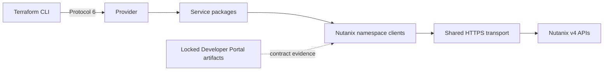

# Terraform Provider for Nutanix

[](https://github.com/ioplane/terraform-provider-nutanix/actions/workflows/ci.yml)
[](https://go.dev/doc/go1.26)
[](https://developer.hashicorp.com/terraform/plugin/terraform-plugin-protocol)
[](LICENSE)

Hand-written Terraform Plugin Framework provider for the Nutanix Cloud Platform.

> [!WARNING]
> The provider is pre-release. The implemented data sources are not covered by the deferred
> product acceptance gate and must not be treated as a stable compatibility surface.

## Provider contract

| Property | Value |
| --- | --- |
| Terraform Registry address | `ioplane/nutanix` |
| Provider type | `nutanix` |
| Framework | Terraform Plugin Framework |
| Protocol | Terraform Plugin Protocol 6 |
| Go module | `github.com/ioplane/terraform-provider-nutanix` |
| Runtime SDK policy | No Nutanix SDK and no generated implementation code |

## Implemented surface

| Terraform data source | Nutanix API | Documentation |
| --- | --- | --- |
| `nutanix_clusters_v2` | Cluster Management v4.2 | [Schema](docs/data-sources/clusters_v2.md) |
| `nutanix_categories_v2` | Prism v4.3 | [Schema](docs/data-sources/categories_v2.md) |
| `nutanix_images_v2` | VMM v4.2 | [Schema](docs/data-sources/images_v2.md) |
| `nutanix_subnet_v2` | Networking v4.3 | [Schema](docs/data-sources/subnet_v2.md) |
| `nutanix_roles_v2` | IAM v4.0 (provisional) | [Schema](docs/data-sources/roles_v2.md) |
| `nutanix_operations_v2` | IAM v4.0 (provisional) | [Schema](docs/data-sources/operations_v2.md) |
| `nutanix_licenses_v2` | Licensing v4.3 (provisional) | [Schema](docs/data-sources/licenses_v2.md) |
| `nutanix_license_keys_v2` | Licensing v4.3 (provisional) | [Schema](docs/data-sources/license_keys_v2.md) |

| Terraform resource | Nutanix API | Documentation |
| --- | --- | --- |
| `nutanix_category` | Prism v4.3 (provisional) | [Schema](docs/resources/category.md) |
| `nutanix_subnet` | Networking v4.3 (provisional) | [Schema](docs/resources/subnet.md) |
| `nutanix_storage_container` | Cluster Management v4.2 (provisional) | [Schema](docs/resources/storage_container.md) |
| `nutanix_image_placement_policy` | VMM v4.2 (provisional) | [Schema](docs/resources/image_placement_policy.md) |

IAM role and operation data sources remain outside the accepted compatibility surface until exact
Nutanix MCP corroboration and product verification are complete.

The category resource is the first managed-resource slice. It remains outside the accepted
compatibility surface until product verification and exact MCP operation-level corroboration are
complete. Actions, functions, and ephemeral resources are not registered.

## Architecture



The provider is a modular monolith. Terraform schemas and state remain in service packages;
API DTOs and operation policies remain in namespace packages; authentication, transport,
task polling, and capability discovery are shared kernel components.

See the [architecture](docs/architecture.md) and [provider contract](docs/contract.md).

## Development

### Requirements

- Podman with Compose support;
- `uv` 0.12.1 for the host launcher environment;
- Git and GitHub CLI for repository control-plane operations.

All development commands run in the pinned Podman toolbox based on
`golang:1.26-trixie`.

```bash
./dev up
./dev task versions
./dev task all
./dev shell
./dev down
```

`./dev task all` runs formatting, static analysis, vulnerability scanning, artifact validation,
documentation validation, release configuration checks, and a provider build. Product tests are
deferred until the corresponding product corpus is complete.

## Documentation

| Document | Purpose |
| --- | --- |
| [Architecture](docs/architecture.md) | Package boundaries and request flow |
| [Provider contract](docs/contract.md) | Public configuration and behavior |
| [Nutanix artifacts](docs/standards/nutanix-artifacts.md) | API source and lock policy |
| [Go standard](docs/standards/go-1.26.md) | Toolchain and implementation rules |
| [Dependency policy](docs/standards/dependencies.md) | Approved runtime and test modules |
| [Naming standard](docs/standards/naming.md) | Go and Terraform naming conventions |
| [Verification standard](docs/standards/testing.md) | Product-first verification policy |
| [Release process](docs/release-process.md) | Release Please and GoReleaser pipeline |
| [Roadmap](docs/roadmap.md) | Product delivery scope |

## Contributing and security

See [CONTRIBUTING.md](CONTRIBUTING.md), [SECURITY.md](SECURITY.md), and
[CODE_OF_CONDUCT.md](CODE_OF_CONDUCT.md).

## License

Licensed under the [Apache License 2.0](LICENSE).
