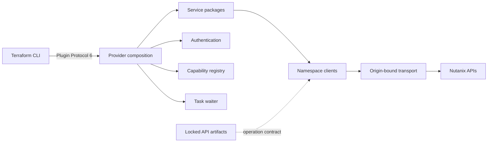
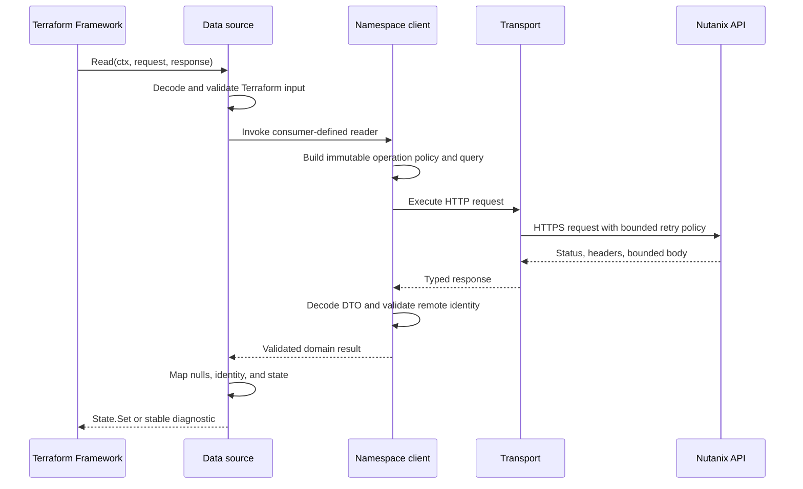
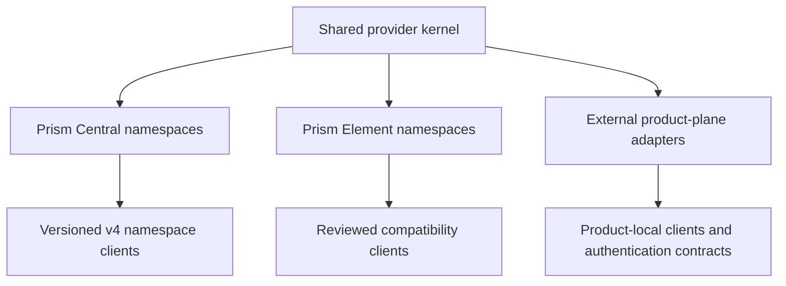

# Provider architecture

## System context

The provider is a single Terraform Plugin Framework binary implemented as a modular monolith.
Terraform-facing code and Nutanix wire code use explicit interfaces at their point of consumption.

## Package boundaries

| Package | Responsibility | Forbidden dependency |
| --- | --- | --- |
| `cmd/terraform-provider-nutanix` | Protocol 6 process entry point | Product implementation |
| `internal/provider` | Provider schema, configuration, composition, registration | Namespace DTO ownership |
| `internal/service/<domain>/<type>` | Terraform schema, models, diagnostics, state mapping | Raw transport and authentication |
| `internal/nutanix/<namespace>` | Paths, operation policies, DTOs, response validation | Terraform Plugin Framework |
| `internal/transport` | HTTPS, retry, body limits, typed HTTP errors, pagination primitives | Namespace DTOs |
| `internal/auth` | Basic and API-key credential application | Logging and Terraform packages |
| `internal/task` | Context-bound vendor-neutral task state machine | Namespace packages |
| `internal/capability` | Concurrent positive and negative capability cache | Transport and namespace packages |

Production code remains under `cmd/` and `internal/`. Catch-all packages named `api`, `common`,
`core`, `types`, or `util` are not allowed.

## Implementation boundary

- Transport, DTOs, Terraform schemas, and state models are hand-written.
- Nutanix SDKs are not runtime dependencies.
- OpenAPI and Postman artifacts are contract evidence and validation inputs, not code-generation
  inputs.
- Provider composition constructs one authentication policy, one origin-bound transport, namespace
  adapters, one task waiter, and one capability registry.
- Service packages receive the smallest consumer-defined interface required by the Terraform type.
- Configuration constructs clients without a live network call.

## Reuse and ABI guardrails

Shared behavior belongs in the narrowest existing layer that owns its contract:

- `internal/transport` owns HTTPS execution, bounded responses, retries, request identity, and
  typed HTTP failures.
- `internal/nutanix/odata` owns list-query validation and caller-query identity.
- `internal/service/listdata` and `internal/service/listquery` own the common Terraform list-data
  source lifecycle and query attributes.
- `internal/task` owns the vendor-neutral asynchronous task state machine; namespace clients only
  supply task identity and operation policy.
- Provider composition and service packages keep consumer-defined interfaces local to their users;
  a shared interface is introduced only when two consumers require the same behavioral contract.

Repeated field mapping remains in the owning service when the Terraform models or null semantics
are different. Generic helpers are appropriate for identical transport or decoding workflows, as
demonstrated by the Licensing inventory list helper. This keeps semantic duplication visible while
avoiding a catch-all conversion package.

The process boundary is Terraform Plugin Protocol 6. `cmd/terraform-provider-nutanix` serves with
`providerserver.Serve` and `ProtocolVersion: 6`; provider tests use `tfprotov6.ProviderServer` to
verify schema, configuration, and diagnostic redaction without a live Nutanix target. Changes to
the provider entry point, framework version, Protocol 6 types, or Go toolchain require the pinned
container protocol gate before they can be considered compatible.

## Read lifecycle

No reflection, generated client, package-global client, or service locator participates in the
call path.

## Transport invariants

| Area | Invariant |
| --- | --- |
| Origin | Requests remain on the configured HTTPS authority; redirects are rejected |
| Authentication | Credentials enter headers immediately before dispatch and never enter logs or errors |
| Retry | Operation policy selects retry eligibility; HTTP method alone is insufficient |
| Mutation identity | A stable `NTNX-Request-Id` spans eligible attempts for one logical operation |
| Responses | Success and error bodies are bounded and closed on every path |
| Pagination | Zero-based, bounded, callback-driven, and never follows arbitrary remote URLs |
| Concurrency | ETags are explicit transport values; update operations use reviewed `If-Match` behavior |
| Logging | `tflog` records allowlisted metadata and path templates only |

## State and error ownership

Namespace DTO pointers preserve JSON null. Services map nil scalars to Terraform null values, nil
collections to typed null lists, and non-nil empty slices to empty lists. State is written only after
the complete response passes decoding and identity validation.

Transport returns typed status and protocol errors without response bodies. Namespace packages add
operation context and preserve stable causes with `%w`. Service packages translate failures once
into Terraform Framework diagnostics.

## Product planes

Each plane owns its endpoint, authentication, capability, and version contract. Provider aliases
represent multiple endpoints; one provider instance does not fan out across unrelated authorities.

## References

- [Provider contract](contract.md)
- [Nutanix artifact standard](standards/nutanix-artifacts.md)
- [Go dependency policy](standards/dependencies.md)
- [Terraform Plugin Framework](https://developer.hashicorp.com/terraform/plugin/framework)
- [Terraform Plugin Protocol](https://developer.hashicorp.com/terraform/plugin/terraform-plugin-protocol)
