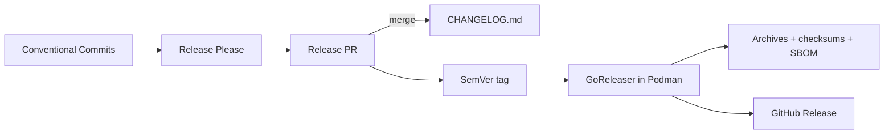

# Release process

## Pipeline



Release Please owns version calculation, the release pull request, `CHANGELOG.md`, the SemVer tag,
and the initial GitHub Release. GoReleaser runs inside the pinned Podman toolbox and attaches binary
archives, checksums, and SBOMs to that release.

## Control points

| Stage | Trigger | Control | Output |
| --- | --- | --- | --- |
| Change classification | Commit reaches `main` | Conventional Commit subject and footer | Release intent |
| Release proposal | `push` to `main` | Release Please manifest and configuration | Release PR |
| Validation | Release PR branch | Required `Foundation` workflow and review | Mergeable release PR |
| Version publication | Release PR merge | Protected `main` and Release Please | `CHANGELOG.md`, SemVer tag, GitHub Release |
| Artifact build | Release tag output | GoReleaser in Podman | Linux `amd64` and `arm64` archives |
| Supply-chain metadata | GoReleaser archive pipeline | Syft in Podman | SHA-256 checksum file and SPDX JSON SBOM per archive |
| Publication | Existing GitHub Release | GitHub token limited to the workflow | Attached release artifacts |

> [!IMPORTANT]
> Release PRs are never auto-merged. Manual tags, manual changelog version sections, and host-built
> release binaries are outside the release contract.

## Version policy

The project uses [Semantic Versioning](https://semver.org/spec/v2.0.0.html). Before `v1.0.0`,
release intent follows these rules:

| Conventional Commit | Version effect |
| --- | --- |
| `feat:` | Minor |
| `fix:` or `perf:` | Patch |
| `feat!:` or `BREAKING CHANGE:` | Minor before `v1.0.0`; major from `v1.0.0` |
| Non-user-facing maintenance type | No release by default |

The repository manifest stores the last released version. Before the first tag, exactly one
Conventional Commit carries the footer below to select the pre-major bootstrap version:

```text
Release-As: 0.1.0
```

After `v0.1.0`, the manifest is the version authority and bootstrap `Release-As` footers are not
used.

## Workflow behavior

1. The release workflow runs Release Please on every push to `main`.
2. When Release Please creates or updates a release PR using `GITHUB_TOKEN`, the workflow explicitly
   dispatches `ci.yml` on the release branch with an explicit repository selector because
   token-created pull requests do not emit another pull-request workflow event and the release job
   has no checkout at that stage.
3. The release PR remains subject to branch protection, required review, and the `Foundation` check.
4. Merging the release PR produces the changelog update, SemVer tag, and GitHub Release.
5. The same workflow checks out the emitted tag, starts the private Podman API service, builds the
   pinned development image, and runs `./dev task release:build`.
6. The host GitHub CLI attaches only the validated GoReleaser archives, checksum file, and SBOMs to
   the existing release. The build container never receives a GitHub token.

## Artifacts

For version `<version>`, the release contains:

```text
terraform-provider-nutanix_<version>_linux_amd64.zip
terraform-provider-nutanix_<version>_linux_arm64.zip
terraform-provider-nutanix_<version>_SHA256SUMS
terraform-provider-nutanix_<version>_linux_amd64.zip.sbom.json
terraform-provider-nutanix_<version>_linux_arm64.zip.sbom.json
```

Archives contain the protocol provider binary and `LICENSE`. GoReleaser builds with
`CGO_ENABLED=0`, `-trimpath`, the tagged version in linker metadata, and the commit timestamp for
reproducible archive metadata.

## Recovery

- A failed release build leaves the GitHub Release without binary attachments and fails closed.
- Re-run the workflow for the tagged commit after correcting infrastructure-only failures.
- Never move or recreate an existing SemVer tag.
- A source defect requires a new Conventional Commit and a new release PR.

## References

- [Release Please](https://github.com/googleapis/release-please)
- [Release Please Action](https://github.com/googleapis/release-please-action)
- [GoReleaser](https://goreleaser.com/)
- [Syft](https://github.com/anchore/syft)
- [Conventional Commits](https://www.conventionalcommits.org/en/v1.0.0/)
