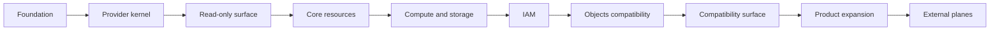
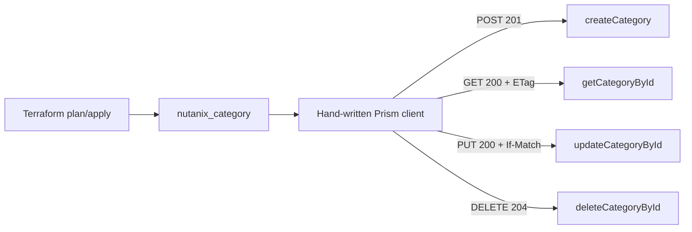
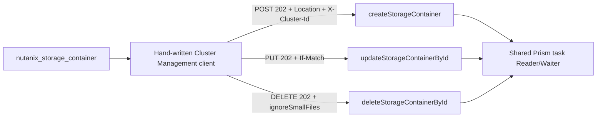
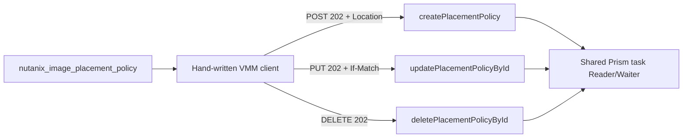

# Product roadmap

## Delivery model

Each phase requires an API contract, hand-written implementation, containerized static gate, and
deferred product verification before a stable compatibility claim.

## Priority rebaseline — 2026-08-17

The current implementation has 4 registered resources and 9 registered data sources. Development
priority follows evidence and release risk rather than namespace breadth:

| Priority | Work | Beads | Exit condition |
| --- | --- | --- | --- |
| P0 | Rebuild the pinned toolbox on Go 1.26.6 and clear the current standard-library vulnerability baseline | `ntnx-d76.2` | The immutable toolbox reports Go 1.26.6, Protocol 6 and foundation checks pass, and `govulncheck` is clear or has explicit reachable findings tracked |
| P1 | Close service-layer contract-test debt across the registered surface | `ntnx-c57.1` | Deterministic schema, request, response, state, error, and redaction tests cover each service slice |
| P1 | Reconcile Licensing v4.3 and IAM contracts with exact portal, MCP, and RE evidence | `ntnx-c57.2`, `ntnx-m2.7`, `ntnx-m9.1` | Exact operation evidence and version-qualified model decisions are recorded before product claims |
| P1 | Finish the Go/Testcontainers automation migration and keep the Podman runtime gate reproducible | `ntnx-1vw` | No Python execution remains; the host Podman socket runs the bounded Go container test and cleanup is verified |
| P2 | Review pinned Beads/Syft upgrades and reachable transitive Go updates | `ntnx-d76.4`, `ntnx-d76.1` | Release notes, compatibility, hashes, ABI, SBOM, and complete gates justify each applied update; deferred updates have evidence |
| P2 | Run authorized product verification for the implemented read-only and resource slices | `ntnx-m2`, `ntnx-m9.1` | Isolated target, bounded cleanup, and independently verified acceptance evidence |
| P3 | Expand compute, storage, Objects, and external product planes | future slices | Each namespace has its own locked contract, implementation, service tests, and product gate |

The shared kernel and list-data abstractions are already in place, so broad namespace expansion is
lower priority than proving the existing 13 registrations. No new compatibility surface should be
added while an earlier priority lacks its contract or product evidence.

## Phases

| Phase | Scope | Status |
| --- | --- | --- |
| Foundation | Reproducible Podman environment, Protocol 6 provider, repository gates | Implemented; Go security baseline pending |
| Kernel | Configuration, authentication, transport, retry, pagination, ETags, task and capability services | Complete |
| Read-only surface | Cluster, category, image, subnet, provisional IAM role and operation, and Licensing v4.3 inventory data sources | Implemented; service coverage and product verification pending |
| Core resources | Categories, projects, subnets, storage containers, policies, and image placement | Category, subnet, storage-container, and image-placement-policy slices implemented; product verification deferred |
| Compute and storage | Virtual machines, volume groups, affinity, and block storage | Planned |
| IAM | Provisional roles and operations; directories, users, groups, policies, and user keys planned | Roles and operations implemented; MCP verification pending |
| Objects compatibility | Object Store lifecycle compatible with public API constraints | Planned |
| Compatibility surface | Downstream resource, data-source, import, and state compatibility | Planned |
| Segmented Objects | Draft, precheck, and deployment actions | Planned |
| Product expansion | All locked GA v4 namespaces | Licensing v4.3 applied-license, license-key, and license-feature inventories implemented; remaining namespaces planned |
| External planes | Foundation, Foundation Central, NDB, Self-Service, NC2, NKP, NDK, NAI, Move, Beam, and Flow Security Central; deprecated NKE compatibility decision only | Planned |

## API research snapshot

The secondary breadth index is pinned to
`ioplane/nutanix-api@d68ea9bd88d5b6a630c4ad04041bed7f97978c62`. It identifies candidates;
the Developer Portal lock and exact-operation corroboration remain the implementation gate.

| Finding | Verified snapshot | Plan decision |
| --- | --- | --- |
| Indexed breadth | 31 API families, 2,516 raw rows, and 2,166 distinct JSON records | Use for coverage and backlog discovery only |
| Non-null path fields | 1,435 records | Treat as syntactic candidates, not operation-exact routes |
| Missing REST paths | 1,081 records | Block operation, payload, state, and lifecycle design |
| Attribution conflicts | Flow Security Central and NAI contain the same 350 records | Re-establish product provenance before qualification |
| Legacy path collapse | 372 Prism v2 rows resolve to 71 method and path pairs | Re-extract before compatibility implementation |
| Portal version agreement | 15 of 18 indexed v4 families | Preserve the repository-selected version per namespace |
| Version conflicts | AIOps, Prism, and VMM | Qualify separately; do not replace a locked version |
| Portal-only namespace | Storage `v4.0.a3` preview | Keep preview status explicit and fail closed |
| Licensing | Direct Portal v4.3 and MCP agree on 17 paths/19 operations; `listLicenses`, `listLicenseKeys`, and `listFeatures` are exact. The repository manifest now selects GA v4.4 (20 paths/22 operations) | Keep the three v4.3 inventories provisional; reconcile the v4.4 lock before changing implementation paths or state |
| PC 7.6 extraction | Resource Groups, security, Objects data-plane, alerts, and SaaS signals | Treat binary and protobuf results as discrepancy evidence, not REST contracts |
| PC 7.6 runtime gaps | Projects 2.0, Security Profiles, and Storage Dashboard are Java microservices absent from offline SDK/API artifacts | Require live PC 7.6 extraction and exact public-contract corroboration before adding provider surfaces |
| Objects and LCM updates | Objects Manager inspection added 86 internal gRPC handlers; LCM inspection added 23 services/193 RPC methods | Keep as product research and discrepancy evidence; do not infer REST routes or Terraform contracts |
| Licensing correction | `licensing-go-client/v4` v4.3 is publicly available; previous RE-only gap was withdrawn | Use the direct Portal v4.3 artifact and exact operation gate for the current slice; SDK remains comparison-only |

The source snapshot contains stale human summaries that report 2,521 total operations, 925 v4
operations, and 1,477 concrete paths. The machine records resolve to 2,516, 920, and 1,435 non-null
path fields respectively. Provider planning uses independently computed values and never promotes
a source claim that conflicts with its underlying records.

### Licensing version-qualified audit — 2026-08-18

The current v4.3 implementation is backed by the direct Portal artifact
[`licensing/v4.3/yaml`](https://developers.nutanix.com/api/v1/namespaces/licensing/versions/v4.3/yaml),
observed with SHA-256 `d5475e4a2ec572d0f87381229160ed2f663cd4fc86d56c57fd75627d7724d0a5`, and by MCP
document `api-swagger-licensing-v4.3-all`. Both sources report the same 17 paths and 19 operations.
The repository lock at `specs/nutanix/manifest.json` instead selects Licensing v4.4, whose locked
OpenAPI digest is `77ec78bd2c4b89e2e0f96f8be475b6983167c814e977b3a364804b5507299c2f`; it contains
20 paths and 22 operations. This is an explicit version-alignment debt, not permission to infer
v4.3 behavior from v4.4.

The v4.3 operation qualification is recorded in [`docs/contract.md`](contract.md). Three read-only
inventories are accepted provisionally (`listLicenses`, `listLicenseKeys`, and `listFeatures`), nine
read-only candidates are deferred, and seven mutation/internal operations are rejected from the
current provider scope. Product acceptance remains a separate deferred gate.

The v4.0 `nutanix-re` finding remains historical discrepancy evidence. In particular, its
`creationDate` and `isDeleted` LicenseKey fields do not occur in the v4.3 Portal LicenseKey schema;
they are therefore excluded from Terraform state. Its portal-setting, trial, and reset routes are
not v4.3 operations and are labeled version drift.

## Expansion boundaries

| Workstream | Scope boundary |
| --- | --- |
| M3-M5 | Portal-locked core resources, compute, storage, and IAM |
| M6 | Objects v4 control plane; bucket, object, multipart, and federation data-plane contracts remain separate |
| M7 | Existing v2 and v3 state compatibility only; no new legacy-first resource design |
| M8 | Segmented Objects draft, precheck, and deployment actions |
| M9 | Remaining locked v4 namespaces plus separately qualified product-version candidates |
| M10 | Plane-specific adapters inside the monolithic provider; no assumption of Prism v4 compatibility |

NKP remains a Kubernetes-native qualification target with no REST operations in the secondary
index. NDK remains an unresolved product identity and is not inferred to be NKP or NKE. NKE is a
deprecated compatibility decision only.

## Phase gates

| Gate | Required evidence |
| --- | --- |
| API | Selected public artifact, exact operation, path, version, schema, and error contract; exact MCP corroboration is required before promotion |
| Terraform | Schema, state, identity, import, lifecycle, null, unknown, and sensitivity contract |
| Architecture | Package ownership and complete function interaction path |
| Implementation | Hand-written code passes the complete Podman static and build gate |
| Product verification | Product-scoped tests and authorized acceptance where required |
| Release | Release PR, protected checks, SemVer tag, archives, checksums, and SBOMs |

## Current slice: Prism category resource

The selected Nutanix Developer Portal artifact is `api-swagger-prism-v4.3-all` (OpenAPI 3.0.1,
specification version 4.3.1, minimum negotiation v4.2). Nutanix MCP confirms the Prism document,
security modes, and both category endpoint templates. The sibling locked OpenAPI artifact supplies
the operation IDs, request/response schemas, category constraints, and conditional update/delete
status codes. MCP search currently exposes the Prism specification as coarse document chunks and
does not return operation-level category chunks; this is explicit evidence debt, not a silent
promotion. MCP `Release-Notes-v4-API` also records a failure mode for `GetCategoryById` with
`$expand=detailedAssociations` on categories associated with more than 500 entities or policies.
The managed resource therefore omits association expansion because its state does not consume
those projections; the category data source retains explicit expansion semantics. The resource is
provisional and cannot be released or used for downstream compatibility claims until exact MCP
 operation corroboration and product verification are closed.

## Current slice: Cluster Management v4.2 storage-container resource

The official Developer Portal Cluster Management v4.2 artifact (OpenAPI 3.0.1) defines
`createStorageContainer`, `updateStorageContainerById`, and `deleteStorageContainerById` as
asynchronous operations returning `202`, a `Location` header, and a Prism task reference. Create
requires `X-Cluster-Id`; update requires `If-Match`; all mutations require `NTNX-Request-Id`.
MCP confirms the clustermgmt document and release-note fields `isShared` and
`externalStorageExtId`; the local `nutanix-api` index supplies the immutable endpoint inventory.
The implementation keeps mutable request DTOs separate from the read projection and reuses the
shared transport, task waiter, and exact relation-based entity identity helper. Product
verification remains deferred by policy.

## Current slice: VMM v4.2 image placement policy

| Evidence | Decision |
| --- | --- |
| Developer Portal `vmm/v4.2` | Use `createPlacementPolicy`, `getPlacementPolicyById`, `updatePlacementPolicyById`, and `deletePlacementPolicyById`; CRUD mutations are asynchronous; create/update require `NTNX-Request-Id`, update requires `If-Match`. |
| Local `nutanix-api` | GA v4.3 endpoint inventory exists; implementation must not silently claim v4.3 until the Developer Portal publishes a matching artifact. |
| Nutanix MCP | `api-swagger-vmm-v4.2-all` is present; current search is coarse and does not replace operation-level evidence. |
| Contract focus | Required name, placement type, and bounded category UUID filters; read-only owner/timestamps/enforcement state; suspend/resume remain a separate action decision. |

The selected VMM v4.2 artifact defines category-based image and cluster filters, asynchronous
CRUD operations, and the request-ID/ETag rules recorded above. The implementation keeps the
mutable request DTO separate from the read projection and uses the shared task identity helper.
Product verification remains deferred by policy.
